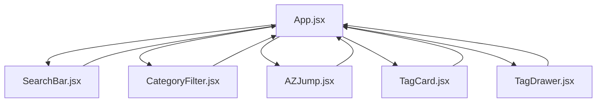

# HTML Tag Reference Page - Implementation Summary

## Project Overview
This document summarizes the complete architecture and implementation plan for the HTML Tag Reference Page web application. The app will provide a comprehensive reference for HTML tags with search, filtering, and detailed information features.

## Key Features
1. **Search Functionality**: Case-insensitive search with 200ms debounce
2. **Category Filtering**: Multi-select category filtering with "All" option
3. **A-Z Navigation**: Quick navigation to tags by first letter
4. **Tag Cards**: Visual display of tag information with highlighting
5. **Detailed Drawer**: Comprehensive tag information with examples
6. **Copy Functionality**: One-click copying of code snippets
7. **Live Preview**: Safe rendering of HTML examples
8. **Responsive Design**: Adapts to mobile, tablet, and desktop
9. **Dark Mode**: Automatic dark/light mode based on system preference
10. **Accessibility**: Full keyboard navigation and screen reader support

## Technical Architecture

### File Structure
```
/
  index.html
  package.json
  README.md
  /src
    main.jsx
    App.jsx
    /components
      SearchBar.jsx
      CategoryFilter.jsx
      AZJump.jsx
      TagCard.jsx
      TagDrawer.jsx
    /data
      tags.json
  /styles
    styles.css
```

### Component Hierarchy


### Data Model
The application uses a JSON data source with the following structure:
```json
{
  "name": "string",
  "categories": ["string"],
  "description": "string",
  "attributes": [
    {
      "name": "string",
      "type": "string",
      "required": boolean,
      "description": "string"
    }
  ],
  "example": "string",
  "mdn": "url",
  "notes": "string"
}
```

## Implementation Approach

### Phase 1: Setup and Data
- Create project structure
- Implement tags.json with sample data
- Set up basic React files (index.html, main.jsx, App.jsx)

### Phase 2: Core Components
- Implement SearchBar with debounced input
- Create CategoryFilter with multi-select
- Build AZJump navigation component
- Develop TagCard display component

### Phase 3: Detailed View
- Create TagDrawer component with all detailed features
- Implement copy functionality
- Add live preview for safe tags
- Ensure accessibility compliance

### Phase 4: Integration
- Connect all components in App.jsx
- Implement state management with React hooks
- Add filtering logic
- Implement highlighting functionality

### Phase 5: Styling and Responsiveness
- Create CSS with dark mode support
- Implement responsive design
- Ensure accessibility styling
- Optimize for performance

### Phase 6: Documentation
- Create comprehensive README
- Add inline code comments
- Document data structure
- Provide setup instructions

## Technical Requirements Compliance

| Requirement | Implementation |
|-------------|----------------|
| ReactJS (JavaScript) | Using React with JavaScript, no TypeScript |
| Minimal CSS | Custom CSS only, no frameworks |
| React Hooks | useState, useEffect, useMemo for state management |
| Local JSON Data | tags.json as data source |
| Search Bar | Implemented with 200ms debounce |
| Category Filter | Multi-select checkboxes with "All" option |
| A-Z Navigation | Horizontal strip with scrolling functionality |
| Tag Cards | Monospace name, description, categories |
| Detail Drawer | Full information with example and preview |
| Copy to Clipboard | For tag name and example code |
| Responsive Design | Grid layout adapting to screen size |
| Accessibility | Semantic HTML, ARIA, keyboard navigation |

## Performance Considerations
- Debounced search to reduce filtering frequency
- Memoization for expensive operations
- Efficient rendering with React keys
- CSS optimization for smooth animations

## Accessibility Features
- Semantic HTML structure
- Keyboard navigation support
- Focus management and visible focus indicators
- ARIA attributes for dynamic content
- Proper color contrast ratios
- Screen reader compatibility

## Responsive Design
- Mobile: Single column layout, modal drawer
- Tablet: Two column layout
- Desktop: Three column layout, side drawer
- Flexible grid system
- Media query breakpoints

## Dark Mode Support
- CSS media query for `prefers-color-scheme`
- Custom properties for theme colors
- Automatic switching based on system preference
- Proper contrast in both modes

## Next Steps
To implement this plan, we need to switch to the Code mode where we can create the actual files and write the React components.

1. Switch to Code mode
2. Create the project files
3. Implement each component according to the specifications
4. Integrate components in App.jsx
5. Add styling and responsiveness
6. Test all features
7. Create documentation
</content>