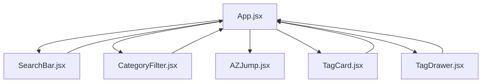

# Technical Specification

## Architecture Overview

The HTML Tag Reference Page is a single-page application built with ReactJS that provides a comprehensive reference for HTML tags. The application follows a component-based architecture with clear separation of concerns.

## Data Flow

1. **Data Loading**: Application loads `tags.json` data on initialization
2. **State Management**: React hooks manage application state (search term, selected categories, filtered tags, drawer state)
3. **User Input**: Users interact with search, filters, and navigation components
4. **Filtering**: Tags are filtered in real-time based on search term and selected categories
5. **Display**: Filtered tags are rendered as cards
6. **Detail View**: Clicking a card opens a detailed drawer with comprehensive information

## Component Communication



## State Management

### App Level State
- `tags`: All tag data from JSON file
- `filteredTags`: Tags after applying search and category filters
- `searchTerm`: Current search input value
- `selectedCategories`: Array of selected category names
- `selectedTag`: Currently selected tag object for detailed view
- `isDrawerOpen`: Boolean flag for drawer visibility

### Component Level State
- SearchBar: Uses debounced state for search input
- CategoryFilter: Manages checkbox states internally
- TagDrawer: Manages copy button states for code snippets

## Performance Considerations

1. **Debounced Search**: 200ms delay reduces filtering frequency
2. **Memoization**: Use `useMemo` for expensive filtering operations
3. **Virtualization**: For large tag lists, consider virtualized rendering
4. **Lazy Loading**: Detailed tag data could be loaded on demand

## Accessibility Implementation

### Keyboard Navigation
- Tab order follows visual layout
- ESC key closes drawer/modal
- Enter/space activate buttons and links
- Arrow keys for category filter navigation

### Screen Reader Support
- Semantic HTML elements
- ARIA attributes for dynamic content
- Proper labeling of form elements
- Live regions for status updates

### Focus Management
- Focus trap in drawer/modal
- Return focus to triggering element on close
- Visible focus indicators
- Skip links for main content

## Responsive Design

### Breakpoints
- Mobile: 0px - 768px
- Tablet: 769px - 1024px
- Desktop: 1025px+

### Layout Changes
- Grid column count adjusts based on screen size
- Drawer becomes modal on mobile
- Horizontal filters become scrollable on small screens
- Font sizes adjust for readability

## Dark Mode Implementation

### CSS Custom Properties
```css
:root {
  --bg-color: #ffffff;
  --text-color: #333333;
  --border-color: #e0e0e0;
}

@media (prefers-color-scheme: dark) {
  :root {
    --bg-color: #1a1a1a;
    --text-color: #e0e0e0;
    --border-color: #444444;
  }
}
```

### JavaScript Detection
```javascript
const isDarkMode = window.matchMedia('(prefers-color-scheme: dark)').matches;
```

## Security Considerations

### Code Snippet Display
- Sanitize HTML before displaying in examples
- Use `dangerouslySetInnerHTML` carefully with sanitized content
- Escape user input in code examples

### Live Preview
- Only render safe HTML tags
- Sanitize attributes
- Use Content Security Policy headers

## Error Handling

### Data Loading
- Handle missing or malformed JSON
- Display user-friendly error messages
- Provide fallback UI

### Search and Filter
- Handle edge cases (empty search, no matches)
- Clear error states when conditions change

### Copy Functionality
- Handle clipboard API unavailability
- Provide feedback on copy success/failure

## Testing Strategy

### Unit Tests
- Component rendering with different props
- State management logic
- Filter and search functions

### Integration Tests
- Component interaction flows
- Data flow between components

### Accessibility Tests
- Keyboard navigation
- Screen reader compatibility
- Contrast ratios

### Performance Tests
- Load times
- Filtering performance
- Memory usage

## Deployment Considerations

### Build Process
- Optimize assets
- Minify CSS and JavaScript
- Generate source maps for debugging

### Hosting
- Static file hosting (Netlify, Vercel, GitHub Pages)
- CDN for assets
- HTTPS enforcement

### Monitoring
- Error tracking
- Performance monitoring
- User feedback collection
</content>